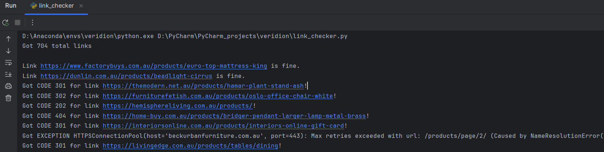
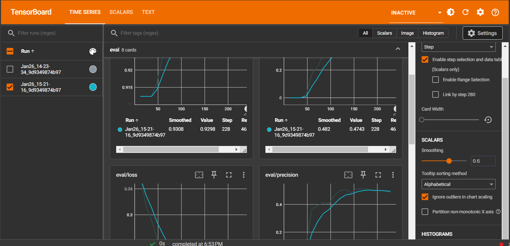

## Furniture products NER with finetuned DistilBERT

Welcome to my very first NLP project!
This NER project tries to predict the furniture products from a 
list of URLs (which are checked for responsiveness before), create
a dataset from their contents (and label some of the products shown there), train an NLP model
to learn how to identify the products and use that model to get product names from unseen webpages.
There are several scripts used here (in the future to become modules) that helped me complete this task.
Even though I will detail what I did here, there are also comments in each of the scripts,
to detail my thought process.
I added the `requirements.txt` file with the packages used throughout this project.

### link_checker.py
In order to use URLs from a list stored in `data/furniture store pages.csv`,
I wanted to check which links can actually be used to grab info from.
Found out that from 704 links, only 197 actually returned HTTP code 200 (OK),
and could be reached. How did I get that number of links?
1. I grabbed the links from csv file: `df = pd.read_csv(self.csv_file)`
2. For each link, I sent a request: `resp = requests.head(link_)`
3. Checked the response for each request:
   1. If the request throws an exception -> avoid that link.
   2. If the request returns 200 HTTP code -> store that link as a good one.
   3. If the request returns ANY other HTTP code -> that link cannot be used, so avoid it.
4. Store the good links in a text file, for easy access (`data/good_links.txt`).
During the link checking, the outputs were telling me which URLs were good to go

There wasn't a lot of trial and error here, because the flow was pretty straight forward. I
have to add that this was my very FIRST time actually grabbing information from URLS,
so I already learned something new. :)
This script was created just for my convenience, it could be run by `python link_checker.py --path_to_csv /path/to/csv/file/with/urls.csv --path_for_text_file /path/for/text/file/with/good/links.txt`.
It will not work if the structure of the csv file is different from the one provided for the assignment, so this is already something to work on later for improvement.

### create_dataset.py
After I gathered a list of working URLs, the next step was to actually create a dataset in order to later train the model.
At this step, the fun started :) I have tried several things before I could actually CORRECTLY grab the information
from the URLs, including:
1. Use `bs4` to grab the text from various HTML tags and store that text. It led to a lot of useless information, not related to furniture products.        
```
soup = BeautifulSoup(html, 'html.parser')`

# Extract text content from relevant HTML elements
# Adjust the HTML tags and classes based on the structure of the web page
extracted_text = ""

for element in soup.find_all(['p', 'h1', 'h2', 'h3', 'h4', 'h5', 'h6']):
   extracted_text += element.get_text() + '\n'
```
2. I have then tried to only include words that are somewhat specific to such products, by searching through the contents.
That somewhat worked, but still a lot of redundant information.
```
# Just asked ChatGPT what are the most recognized furniture types - certainly this is not the full list
furniture_products = ['sofa', 'couch', 'settee', 'chair', 'table', 'bed',
                        'desk', 'dresser', 'armchair', 'recliner', 'accent chair',
                        'table', '', 'side table', 'bedframe', 'headboard',
                        'mattress', 'cupboard', 'wardrobe', 'bookshelf',
                        'ottoman', 'coffee table', 'nightstand', 'dining table',
                        'sideboard', 'cabinet', 'entertainment center', 'futon',
                        'bench', 'stool', 'chaise lounge', 'loveseat']

# check to see if any furniture product specific words are found
for element in soup.find_all(['p', 'h1', 'h2', 'h3', 'h4', 'h5', 'h6']):
   words = element.get_text().lower().split()
   if len(set(words).intersection(furniture_products)) > 0:
      extracted_text += element.get_text() + '\n'
```
3. I also tried getting rid of unnecessary elements from an HTML page, like the CSS style or JS scripts, and get the content that was left after this.
Not really a success after this as well.
```
soup = BeautifulSoup(html, 'html.parser')

for script in soup(["script", "style"]):
   script.extract()

text = soup.get_text()

# ... code to remove unnecessary multiple spaces and break into lines
```

4. Another idea was to completely cut out ALL the HTML tags that may not be useful. This didn't worked, obviously, either way too little info or no useful info at all.
```
def tag_visible(element):
    if element.parent.name in ['style', 'script', 'head', 'title', 'meta', '[document]']:
        return False
    if isinstance(element, Comment):
        return False
    return True


def text_from_html(url):
    try:
        req = urllib.request.Request(url, headers={'User-Agent': 'Mozilla/5.0'})
        html = urllib.request.urlopen(req, context=ssl.SSLContext()).read()

        soup = BeautifulSoup(html, 'html.parser')

        texts = soup.findAll(string=True)

        visible_texts = filter(tag_visible, texts)

        return u" ".join(t.strip() for t in visible_texts)[:100]
    except Exception as e:
        print(f"Error for {url}")
        print(f"An error occurred: {e}")
```

5. I tried to grab only the text from the paragraph elements (`<p></p>`), but I think you can see why that's not the best idea (may leave out important info or only get useless info)
```
soup = BeautifulSoup(html, 'html.parser')

# Extract text from the webpage
text = ' '.join([p.get_text() for p in soup.find_all('p')])
```

6. After some rethinking, chatting with ChatGPT :) and checking some other solutions available, I understood that a good lead
would be to look in the hyperlinks of a URL and see if any of them contain some furniture product words. From those links then, grab the content
and use that as the pages for the dataset. Found that this is the difference between scraping (simply GRAB info from the
web pages) and crawling (FIND and FETCH urls from a root url, to retrieve pages that will be scrapped). And it was the solution I went on with, in the end.
A new thing I learned thanks to this project! :)
```
# Make a request to the main url (from the good links list)
req = urllib.request.Request(url, headers=self.header)
html = urllib.request.urlopen(req, context=self.ssl_context).read()
# Get the structure of the HTML page
soup = BeautifulSoup(html, 'lxml')

# Grab the hyperlinks of the main url
links_in_url = soup.find_all('a')  # get all a-href

# For each link, look at the hyperlinks from the main url and check if it contains some useful words -> that may contain useful info
for link in links_in_url:
    # Similar to what join in Python does, it combines a main url with the hyperlink -> absolute link
    link = urljoin(url, link.get('href'))

    # If one of the furniture types is found in the link, add the link -> it may be useful
    if any([furniture_type in link for furniture_type in furniture_products]):
        linked_furniture_urls.append(link)
```
I only grabbed 5 of the hyperlinks that were found useful, in order to create a small, PoC-like dataset. If this is desired to be a large scale
solution, I would think that ALL useful links should be used to get the content out of them. But this solution worked for this small project.

After grabbing the urls, I again tried to scrap them using `bs4`, but I didn't like the formatting of the text.
I did some digging, again checked other available solutions and found out about a package named `trafilatura`.
And, oh boy, does it work nicely! It's also very easy to use, with 2 lines you can grab (scrap) the content of any url.
```
def get_content_from_url(url: list) -> str:
 html = trafilatura.fetch_url(url)
 url_content = re.sub(r" +", " ", str(trafilatura.extract(html, include_comments=False)))

 # There may be more elegant solutions for this, but I just got the text up until the
 #  max length of the tokenizer that will be used
 return url_content[:512]
```
LATER EDIT: I found out (yesterday, 28th of Jan) that I should have gathered content from all pages of a URL to create a single representative page for that URL and use those
as my dataset. A little too late to modify now, but I now understand what 'crawl some pages' actually means. :)

You're probably wondering why I limited the content to 512 characters, and the answer is that after some playing
with full length texts, and training a model on those, there the problem of batching several texts, as they had different lengths.
The solutions were either to limit the length to the maximum model length of the tokenizer right before training,
but I thought that would mess up the alignment with the labels, or I could just grab texts of maximum length before the training.
It is not by a long shot the best or most elegant solution, but it worked for me in this case, I'm sure I would learn a better solution
"on the job". :D
The script can be run using `python create_dataset.py --path_to_links_file /path/to/text/file/with/good/links.txt --path_to_save_csv /path/to/save/dataset/csv/file`

### label_dataset.py
Now here comes the fun part. How do I tag some of the products from the pages extracted?
Well, I tried several things here too, only one of them (kinda) worked.
1. I tried to be lazy about it at first, and tried using a pre-trained model to label the products from me.
It went... as you would expect. The model didn't exactly understand what I wanted, and either didn't label the furniture products at all,
or it labeled the wrong products as actual products.
```
import spacy

# Load the spaCy English language model
nlp = spacy.load("en_core_web_sm")

df = pd.read_csv("dataset.csv")

# Function to automatically annotate texts with spaCy NER
def spacy_annotation(text):
    # Process the text with spaCy NER
    doc = nlp(text)
    
    # Convert entities to IOB2 format
    # Create an initial label based on the length of the text
    iob2_labels = ['O'] * len(text.split())
    
    try:
        # Extract the entities and their labels
        entities = [(ent.text, ent.label_) for ent in doc.ents]
        
        # Convert entities to IOB2 format
        # IOB2: Inside, Outside, Beginning version 2
        # version 1 vs version 2: https://datascience.stackexchange.com/questions/37824/difference-between-iob-and-iob2-format
        # In IOB2, every entity starts with B(eginning) as a tag
        #  while in IOB1, B- is only used to separate 2 adjacent entities
        for entity, label in entities:
            words = entity.split()
            
            # check if the entity is only a single word or multiple
            if len(words) == 1:
                iob2_labels[doc.text.lower().split().index(words[0].lower())] = 'B-' + label
            else:
                iob2_labels[doc.text.lower().split().index(words[0].lower())] = 'B-' + label
                
                for i in range(1, len(words)):
                    # Label all the entities inside the sentence as inside the entity
                    iob2_labels[doc.text.lower().split().index(words[i].lower())] = 'I-' + label
   except ValueError as e:
        print(f"Error processing text: {text}. Error: {e}")
   
   return ' '.join(iob2_labels)
```

2. I then tried to use HuggingFace's transformers, either in a pipeline, which (from what I understand),
automatically applies a tokenizer to the text. This didn't work either, the model didn't tag the furniture products, since it didn't recognize them (at all, or all of them).
```
from transformers import pipeline

# Load CSV file
df = pd.read_csv("dataset.csv")

# Load the zero-shot classification pipeline from transformers
ner_pipeline = pipeline(task="ner", model="dbmdz/bert-large-cased-finetuned-conll03-english")


# Function to automatically annotate texts with transformers NER
def transformers_annotation(text):
    # Use the transformers NER pipeline
    entities = ner_pipeline([text])

    # Convert entities to IOB2 format
    iob2_labels = ['O'] * len(text.split())

    for entity in entities[0]:
        print(entity)
        
        # Apply the IOB2 labeling scheme, based on the entity position (as predicted by the model)
        for i, word in enumerate(text.split()):
            if word in entity["word"]:
                if i == entity["start"]:
                    iob2_labels[i] = 'B-' + entity["entity"]
                elif i > entity["start"]:
                    iob2_labels[i] = 'I-' + entity["entity"]

    return ' '.join(iob2_labels)
```
3. I found out that spacy also has a matcher that could be used to set some rules (or patterns) for the labeling.
Tried it, but again it didn't work, from the same reasons as before. The problem is that the model doesn't predict many of the
furniture items as actual products.
```
import spacy
from spacy.matcher import Matcher

nlp = spacy.load("en_core_web_sm")
matcher = Matcher(nlp.vocab)

# Define a pattern for product names
furniture_patterns = [
    [{"LOWER": {"IN": ["sofa", "couch", "settee", "loveseat"]}}],
    [{"LOWER": {"IN": ["chair", "armchair", "recliner", "accent chair"]}}],
    [{"LOWER": {"IN": ["table", "coffee table", "dining table", "side table"]}}],
    [{"LOWER": {"IN": ["bed", "bedframe", "headboard", "mattress"]}}],
    [{"LOWER": {"IN": ["cabinet", "wardrobe", "cupboard", "dresser"]}}]
]

matcher.add("furniture_match", furniture_patterns)


# Function to apply rule-based matching
def rule_based_matching(text):
    doc = nlp(str(text))
    matches = matcher(doc)

    iob2_labels = ['O'] * len(doc)

    for match_id, start, end in matches:
        iob2_labels[start] = 'B-PRODUCT'

        for i in range(start + 1, end):
            iob2_labels[i] = 'I-PRODUCT'

    return ' '.join(iob2_labels)
```
4. Not too different from the previous attempt, I also tried the IOBE labeling scheme (Inside, Outside, Beginning, Ending)
using spacy and a matcher, still it didn't work.
5. The solution which I chose in the end was a mixture of the third attempt (use some kind of pattern or rule)
and the fact that maybe the title of the url may contain the name of the product(s). Hence, try to find words from the title of the url
in the content of the scrapped url. And it did work, in a way, not a perfect one, but enough to yield a somewhat pleasing performance.
```
from nltk.tokenize import sent_tokenize # pretty useful to split into sentences

def grab_url_title(self, url):
  req = request.Request(url, headers={'User-Agent': 'Mozilla/5.0'})
  html = request.urlopen(req, context=self.ssl).read()

  try:
      soup = BeautifulSoup(html, 'html.parser')
      title = soup.find('title').string

      # Drop multiple whitespaces (+: 1 or more)
      title = re.sub(r" +", " ", title)

      # Drop multiple '\n\'s
      title = re.sub(r"\n", "", title)

      return title.lower()
  except Exception as e:
      print(f"Couldn't get the title of url {url}, got error {str(e)}")
      return ""

# The main star of this piece of code:
def label_url_content(self, csv_to_be_saved):
  """
  For each link in the csv file
      Get its title -> soup or smth else (trafilatura)
      Split the text for that url into sentences
      Then split sentences into words
      Create a label of '0' (OUTSIDE) for the length of words list.
          If we got a word from the title -> label as 'B-PRODUCT' (1)
          If the previous token label was 1 or 2 ('I-PRODUCT') and word from the title -> label as 'I-PRODUCT' (2)
  Label the text like so
  """
  df = pd.read_csv(self.csv)

  urls = df['url'].tolist()
  contents = df['text'].tolist()
  labels = []

  for url, content in zip(urls, contents):
      labels_content = []

      title_url_words = self.grab_url_title(url).split()

      content_sentences = sent_tokenize(content)
      # content_sentences = [sentence.split("\n") for sentence in content_sentences if '\n' in sentence]
      # content_sentences = [sentence for sentence in content_sentences]

      print("SENTENCES: ", content_sentences)

      # using IOB2 labeling scheme
      for sentence in content_sentences:
          words = sentence.lower().split()

          label = [0] * len(words)

          label = [1 if word in title_url_words else 0 for word in words]

          # Tried using list comprehension, but didn't really work (for now)
          # if len(label) > 2:
          #     label = [2 if label[pos - 1] > 1 and word in title_url_words else label[pos]
          #              for word in words for pos in range(1, len(label))]

          if len(label) > 2:
              for elem in range(1, len(label)):
                  # If the word is found in the title's word, and
                  #  we are still in the product name (either B-eginning or I-nside)
                  if words[elem] in title_url_words and label[elem - 1] > 0:
                      label[elem] = 2

          labels_content.extend(label)

      labels.append(labels_content)
   
  # Create a new column with the labels
  df['label'] = pd.Series(labels)  # add the new 'label' column to the dataset
  df.to_csv(path_or_buf=f"./{csv_to_be_saved}",
            sep=',',
            index=False)
```
Again, learned something new: you can use the words from the title of a URL to find the products from the content of that URL.
Lots of good stuff from this project :)
It can be either run in PyCharm, or in command line by using `python label_dataset.py --path_to_csv /path/to/csv/dataset/file.csv --path_to_save_labeled_csv /where/to/save/labeled/dataset.csv`

### train.py
Now when it comes to training, things were much more straight forward. Load the dataset, split it into train and val sets,
load a model and a tokenizer (a new thing that's different from my everyday use of ML) - which is a model used
to create tokens (a model's way of representing words - still learning the NLP ways, bear with me),
tokenize the inputs, align the labels with the tokens (a new thing that I didn't know is needed, it basically
creates a more realistic label representation, by removing special characters - [CLS], [SEP] etc. - and only labels the first token of a word - if this is the option chosen),
create the custom datasets (with train and val data) + data collator (to batch-ify the inputs) and start the training.
I have to say, this was the most fun part of this project, because is what I love to do the most - experimenting with ML models),
and was also very nice to find how exactly NLP models are trained.
The script train.py was created only to keep the training code in this format also, I mainly worked in a Google Colab notebook (`notebooks/Finetune_DistilBERT_NER_furniture.ipynb`).
Why Colab? It gives me access to GPUs / TPUs and I don't have to stress myself with creating virtual environments. 
I didn't arrange it too much simply because I experimented mainly in Google Colab.
There is also the option to see some graphs, performance metrics and checkpoints saved using TensorBoard, which I set it in the notebook:
```
model_checkpoint = "distilbert-base-uncased"
task = 'furniture-products-ner'

model_output_dir = f"{model_checkpoint}-finetuned-{task}"
print(model_output_dir) # distilbert-base-uncased-finetuned-imdb

# Start TensorBoard before training to monitor it in progress
%load_ext tensorboard
%tensorboard --logdir '{model_output_dir}'/runs
```
I trained to model for various number of epochs, ranging from 5 to 25 epochs. Although the model reaches over-training at over 20 epochs,
due to the small number of data, I still think it needs some time to grasp the pattern of correctly tagging the product names.
The performance is ok, not great. At epoch 25, I got the following stats:
`{
   "epoch": 25.0,
   "eval_accuracy": 0.9413793103448276,
   "eval_f1": 0.5393258426966292,
   "eval_loss": 0.2159069925546646,
   "eval_precision": 0.5714285714285714,
   "eval_recall": 0.5106382978723404,
   "eval_runtime": 4.4779,
   "eval_samples_per_second": 5.36,
   "eval_steps_per_second": 0.447,
   "step": 350
}`
I added a png file to display how the Tensorboard was looking during training.

For this problem, I thought that the F1-score is the most important metric, due to the unbalanced number of 0 labels (corresponding to 'Outside').
The loss is still pretty high (0.21), but more data and more training time should do the trick. I think under-sampling the 0-class should also help
with the performance. Overall, I'm pretty happy with my very first 'working' NLP model :)

### predict.py
The very last step of this project was to use the trained model to predict the products from unseen pages.
I tried to re-use the code for extracting content from URLs and also for running the model (using HuggingFace's pipeline object).
The results are ok-ish, in most cases, the product names are correctly tagged, although it may miss some of them or being way too confident in
tagging punctuation marks as products.
I created a (very) simple script that basically does that, it expects either a csv file with the same structure as the csv file received for this project,
or a text file with a series of links, grabs the content from those urls and uses the model to predict the product names.
It also saves the resulted product names in a json file, with the corresponding list of products detected for each url.
I added a method that can receive a web page and predicts based on that, used later for the visualization script.
A TODO on my list is to actually aggregate more pages and do inference on that.
It can be run using `python predict.py --path_to_links_file /path/to/links/file.(csv/txt) --path_to_save_json_result_file /path/where/to/save/json/file`
I included 2 json files to see how the results look like, for the urls in the csv received (`entities_all_urls.json`) and the text file I created with reachable and ok links (`entities_good_urls.json`).


### visualize.py
I also tried to do something more creative for the product names that are predicted from an 'unseen' url, in which to
create a webpage which expects a URL, grabs the content from all pages of that URL and predicts all the products it can detect.
I also added the option to download the JSON as a file (`products_from_url.json`), but I still have to work on the formatting.
It can be run as `python visualize.py` and navigate to `http://127.0.0.1:5000` to introduce the URL and receive the result (it may take some seconds before the results are printed).
This is just a very simple way of using the model, and I wanted to include it just to learn a bit how Flask works (and maybe use it more in the future).
The result is again saved in a json file, although many other things could be done here:
1. Maybe grab the reviews for a product and try to actually predict the most popular furniture product (as you suggested)
2. Add the ability to load a file with links and predict on those
3. Check the quantities for the products on a webpage and retrieve the ones with enough items in stock or out of stock.
4. Get the products that are on sale or are sold like freshly baked bread.
5. Help the client by retrieving a list of products that are most clicked on (or verified daily) by the users.
Probably not all of these ideas are still in the task of NER, but I think these may be directions to go to.

## Conclusion
I can proudly say I managed to start, work on and finish my very first NLP project! :)
It was a very interesting, pretty challenging but very rewarding experience, in which I learned a lot.
If I manage to find so many new things in such a short time, I can only imagine what's like to work on this stuff on a daily basis :)
Some things that worth mentioning:
1. Is it a perfect project? Or a perfect / elegant / extraordinary solution for this task? NO. Not by a long shot.
There are many things that could be changed / enhanced:
   1. The code could be organized much more nicely, with modules, more classes and correctly named arguments or methods.
   2. The idea of labeling / tagging products for training by looking at URL titles may not be the best one, as the performance is also not great. Maybe check the
   user reviews and look for words from those to tag contents (?)
   3. The dataset could have been balanced to lower the number of 0-labeled entities, and get a better F1-score, probably.
   4. A bigger dataset, including all the URLs from a main URL, not just 5 of them.
   5. The code is not optimal, lost of it could be re-used, not re-written, and the complexity of some methods is too big.
   6. The Flask app is extremely limited and lacks any *sparks*.
2. Did I enjoy it? YES. I really liked that it challenged me in trying different solutions for a problem, 
understand (kinda) why a thing worked, and why it didn't, etc.
3. Would I do it again ? OF COURSE. It is an amazing feeling of finally getting past a problem after some hours of debugging and re-assessing your life decisions.


### LE:
Added some new files that make up another version of this project, inspired by a solution found online.
This solution ditches the NER objective, and instead focuses on creating a BCE objective, in which
a custom dataset is created, with product and non-product examples, labelled with 1 and 0, respectively.
A custom BERT model is trained on these examples, freezing the backbone and adding 2 FC layers, that will be
trained to predict if a text is present the name of a product or not.

#### crawler.py
This version of the crawler is able to grab information from a URL and its links (contents of `<a href=...>`) up to a certain depth (aka how much
to search for links) and to a certain maximum number of links. The information is extract is very similar, using bs4 to grab the text
from HTML tags of interest (mainly heading tags, since these are the most probable to contain product titles / names).

#### create_dataset_2_0.py
As its name says, this script creates a custom dataset based on the samples stored as JSON files and loads them at the training operation.
It also applies some data augmentation techniques to the samples, like random character deletion, random ASCII character insertion (as noise)
and random trim. It enhances the model's ability to correctly render an incomplete sentence and exposes the model to different situations.

#### custom_model.py
As I said, a new BERT model is created, modifying it to include 2 FC layers at the end, which will be trained to correctly classify
samples as product (1) or non-product (0).

#### train_2.0.py
This training script is fairly similar to the one I originally created, only is raw, in which is not using a HuggingFace Trainer,
rather a manual for loop through the DataLoader, with a manual computation of TPs, FPs etc.
I also added code for using a Trainer, uncomment it and use that if you want (I surely like it more like that).

#### inference.py
A very simple inference interface, that runs the model on a text and returns a dictionary with the output and its confidence.

#### get_products.py
Again, a very simple script that uses the CSV file to grab the URLs stored there, run the inference on each one (and its links)
and create a dictionary with the inference result for every one of them, stored as a JSON file. I added an example of this file
in `outputs/out.json`.